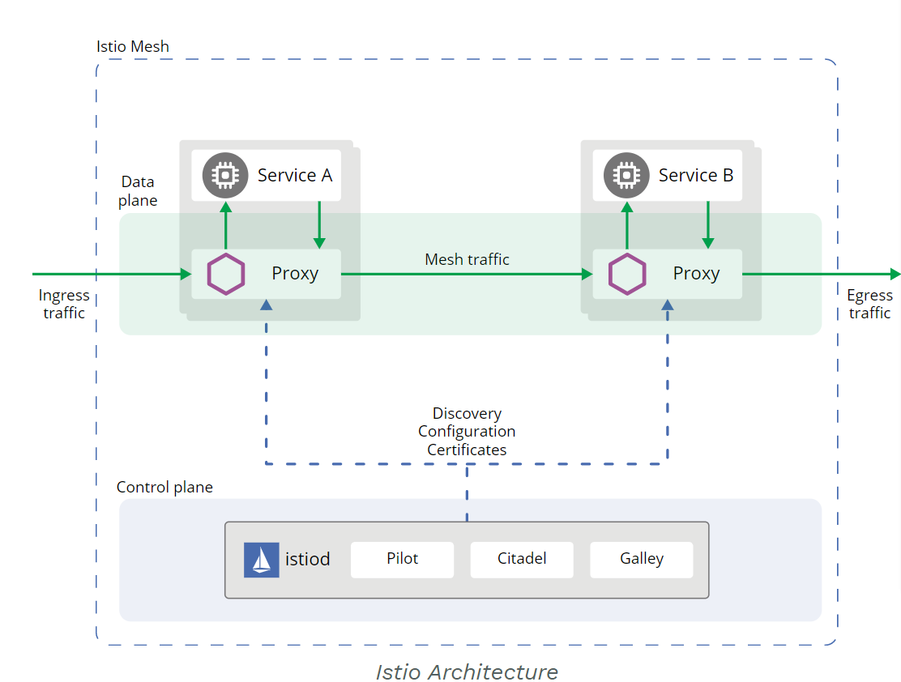

# 第一章 Istio简述

## 1.1 Istio 产生背景

为了实现由 William Morgan 提出的微服务 Service Mesh 模式和诸多理念，Google , IBM 和 Lyft 这三家公司协同研发，并于 2017 年 6 月 8 日( 根据 Github 最后一次提交的时间 )发布了 Istio 的第一个发行版——Istio 0.1 版本。

Istio 围绕着四个主旨设计：

* 连接（Connect）：智能控制服务之间的调用流量，能够实现灰度升级、AB 测试和红黑部署等功能

* 安全加固（Secure）：自动为服务之间的调用提供认证、授权和加密

* 控制（Control）：应用用户定义的 policy，保证资源在消费者中公平分配

* 观察（Observe）：查看服务运行期间的各种数据，比如日志、监控和 tracing，了解服务的运行情况

## 1.2 Istio 功能和范围

### Istio结构

从逻辑上分为数据平面和控制平面：

数据平面：指工作负载的业务逻辑发送和接收的消息
* 由一组智能代理（Envoy）组成，被部署为 sidecar
* * 负责协调和控制微服务之间的所有网络通信
* * 收集和报告所有网格流量的遥测数据。

控制平面：Istio 组件之间发送的配置和控制消息用来编排网格的行为
* 管理并配置代理来进行流量路由

## 1.3 Istio 版本变迁

