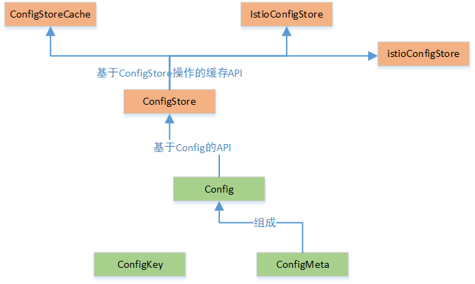

# 第三章 源码选读

略扫过 Istio 的代码，目前关注点都在 ./pilot 和 ./pkg 两个子目录上


## 3.1 主要数据结构

### Config
(pilot/pkg/model/config.go)





**ConfigKey**
基本元素(item)
```
type ConfigKey struct {
	Kind      resource.GroupVersionKind
	Name      string        // 多数情况，即为配置的name； 对 ServiceEntry， 为 FQDN
	Namespace string
}
```

**ConfigMeta**
```
type ConfigMeta struct {
    Type string         // 配置项的简称，对应内容消息体的类型，如 “route-rule”
    Group string      // 配置的 API group
    Version string    // 配置的 API version
    Name string     // 同一 namespace 下唯一
    Namespace string
    Domain string   
    Labels map[string]string    
    Annotations map[string]string
    ResourceVersion string 
    CreationTimestamp time.Time   
}
```

**Config**
配置的基本单元
* 对于每个类型的配置，key 是唯一的
```
type Config struct {
    ConfigMeta
    Spec proto.Message      // pb 协议消息实体
}
```

**ConfigStore**
一系列 API，Istio 的配置实现必须支持
```
type ConfigStore interface {
    Schemas() collection.Schemas
    Get(typ resource.GroupVersionKind, name, namespace string) *Config
    List(typ resource.GroupVersionKind, namespace string) （[]Config, error)
    Create(config Config) (revision string, err error)
    Update(config Config) (newRevision string, err error)
    Delete(typ resource.GroupVersionKind, name, namespace string) error
    Version() string
    GetResourceAtVersion(version string, key string) (resourceVersion string, err error)
    GetLedger() ledger.Ledger
    SetLedger(ledger.Ledger) error
}
```

**ConfigStoreCache**
config 在本地的完整缓存副本
* 与远程副本积极同步 + 对 events 更新提供了同步机制
```
type ConfigStoreCache interface{
    ConfigStore     // 一整套同步用的 API 接口
    
    RegisterEventHandler(kind resource.GroupVersionKind, handler func(Config, Config, Event))   // 顾名思义了
    Run(stop <-chan struct{})
    HasSynced() bool        // true: 初始化阶段的 cache 同步已完成
}
```

**IstioConfigStore**
存储 Istio 配置类型的专用操作对象
```
type IstioConfigStore interface {
    ConfigStore
    ServiceEntries()  []Config      // 所有 service entries 的列表
    Gateways(workloadLabels labels.Collection) []Config     // 所有属于特定 labels 的 gateways 列表
    QuotaSpecByDestination(hostname host.Name) []Config     // 获取指定目标服务实例的 Mixerclient 配置
    ServiceRoles(namespace string) []Config     // 选出指定 namespace 的ServiceRoles
    ServiceRoleBindings(namespace string) []Config  
    RbacConfig() *Config        // 选出名称为 DefaultRbacConfigName 的 RbacConfig 配置
    ClusterRbacConfig() *Config // 选出名称为 DefaultRbacConfigName 的 ClusterRbacConfig 配置
    AuthorizationPolicies(namespace string) []Config    // 
}
```

### Service
pilot/pkg/model/service.go


**Service**
描述一个 Istio Service（如：catalog.mystore.com:8080)
* 每个 service 包含一个 FQDN + 1/多个 port
* [可选] service 有独立的 LB/虚IP 
```
type Service struct {
    Attributes ServiceAttributes        // 包含service额外属性，多用于 mixer/RBAC，用于 policy 功能增强
    Ports PortList          // 一个 service 可有多个 port
    ServiceAccounts []string    // 运行该 service 的 accounts
    CreationTime time.Time
    Hostname host.name  // service 的名称，如：catalog.mystore.com
    Address string  // service LB 的 IPv4 地址
    Mutex sync.RWMutex   // 保护 ClusterVIPs 的并发读写
    ClusterVIPs map[string]string   // service 所在的多个 clusters LB 地址
    
    // 服务解析规则： 包括 
    //  - ClientSideLB: 由Envoy代理根据其本地的LB pool进行请求路由
    //  - DNSLB: 查询DNS服务器得到IP地址，并将请求发到该IP
    //  - Passthrough： 将请求发转发到其原始目的地    
    Resolution Resolution   
    
    MeshExternal bool   // 
}
```

**Locality**
IstioEndpoint 的本地信息
```
type Locality struct {
    Label string         // 
    ClusterID string    // endpoint 所在的 ClusterID
}
```

**IstioEndpoint**
IstioEndpoint 
```
type IstioEndpoint struct {
    
}
```

### Gateway
pilot/pkg/model/gateway.go

**MergedGateway**
单 workload 中多个 gateways，合并成一个独立的 逻辑 gateway
```
type MergedGateway struct {
    Servers map[uint32][]*networking.Server  // 映射：物理Port=>虚拟Server
    GatewayNameForServer map[*networking.Server]string   // 映射：server =>gateway名
    ServersByRouteName map[string][]*networking.Server   // 映射：Port名 => 虚拟host（RDS用）
    RouteNameByServer map[*networking.Server]string     // 映射：server => RDS 路由名（ServersByRouteName 的逆结构）
}
```


### Controller
pilot\pkg\model\controller.go

**Controller**
定义一个事件处理循环
```
type Controller interface {
    AppendServiceHandler(f func(*Service, Event)) error   // 发送 service catalog 的变更通知
    AppendInstanceHandler(f func(*ServiceInstance, Event)) error    // 发送 service 实例的变更通知
    Run(stop <-chan struct{})
}
```

### Sidecar
pilot\pkg\model\sidecar.go

**SidecarScope**
Sidecar 需要的资源，作为可见性规则的一部分
* 是 Sidecar resource 的包装器，带有一些预处理数据，
* 用于确定给定 Sidecar 可访问的Service，VirtualService和 DestinationRule
* 预先计算 Sidecar 的 Service，VirtualService和 DestinationRule 可以提高性能，不再需要为每个 Sidecar 计算此列表，只需将 Sidecar 与 SidecarScope 相匹配
* 若无指定的 sidecar CRD，将会创建一个介入所有 egress listener
```
type SidecarScope struct {
    Config *Config  // crd
    
    EgressListeners []*IstioEgressListenerWrapper   
    
    HasCustomIngressListeners bool
    services []*Service     
    destinationRules map[host.Name]*Config
    OutboundTrafficPolicy *networking.OutboundTrafficPolicy
    configDependencies map[ConfigKey]struct{}
}
```

## 3.2 Pilot-Discovery 主流程


Pilot将服务信息和配置数据转换为xDS接口的标准数据结构，通过gRPC下发到数据面的Envoy
Pilot的输入
包括两部分数据来源：

	* 服务数据： 来源于各个服务注册表(Service Registry)，例如Kubernetes中注册的Service，Consul Catalog中的服务等。
	* 配置规则： 各种配置规则，包括路由规则及流量管理规则等，通过Kubernetes CRD(Custom Resources Definition)形式定义并存储在Kubernetes中。

Pilot的输出

	* 为符合xDS接口的数据面配置数据
	* 并通过gRPC Streaming接口将配置数据推送到数据面的Envoy中。


## 3.3 Pilot-Discovery 初始化流程


