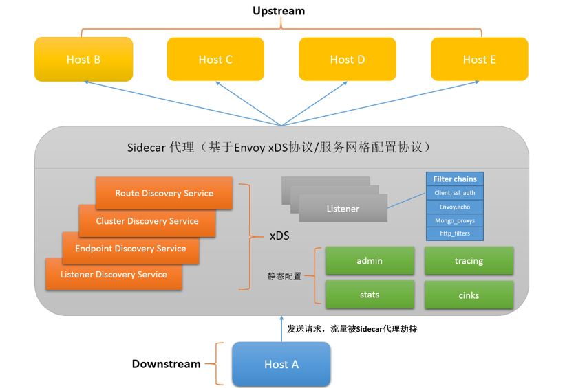

# 第四章 xDS协议

xDS 是 sidecar(如 Envoy) 和 Pilot 之间传输的应用协议，实现基于 gRPC 

## xDS 工作模式

每个XDS Service都有两种GRPC服务， Stream和Delta。 Stream用来更新全量数据，Delta用来更新增量数据

每个 xDS API 可以单独配置 ApiConfigSource，指向对应的上游管理服务器的集群地址。每个 xDS 资源类型会启动一个独立的双向 gRPC 流，可能对应不同的管理服务器。API 交付方式采用最终一致性。

### 组件和概念

Downstream：下游主机，指连接到Envoy的主机，这些主机用来发送请求并接受响应

Upstream：上游主机，指接收来自Envoy连接和请求的主机，并返回响应。

**Listener**：服务或程序的监听器， Envoy暴露一个或多个监听器监听下游主机的请求，当监听到请求时，通过Filter Chain把对请求的处理全部抽象为Filter， 例如ReadFilter、WriteFilter、HttpFilter等

* 可以由下游客户端连接的命名网络位置（例如，端口、unix域套接字等）

* 一般是每台主机运行一个 Envoy，使用单进程运行

    * 但是每个进程中可以启动任意数量的 Listener（监听器）
    * 目前只监听 TCP
    * 每个监听器都独立配置一定数量的（L3/L4）网络过滤器
    
* 也可以通过 Listener Discovery Service（LDS）动态获取
    
Cluster：服务提供集群，指Envoy连接的一组逻辑相同的上游主机。Envoy通过服务发现功能来发现集群内的成员，通过负载均衡功能将流量路由到集群的各个成员。

Http Route Table : HTTP 的路由规则

* 例如：请求的域名，Path 符合什么规则，转发给哪个 Cluster。

**xDS**：xDS中的x是一个代词，类似云计算里的XaaS可以指代IaaS、PaaS、SaaS等

* DS为Discovery Service，即发现服务的意思
* 功能：通过Envoy API V1（基于HTTP）或V2（基于gRPC）实现一个服务端将配置信息暴露给上游主机，等待上游主机的拉取
* xDS包括：

    * CDS（Cluster discovery service）
    * RDS（Route discovery service）
    * EDS（Endpoint discovery service）
    * SDS (Service Discovery Service)：SDS 已在 v2 API 中重命名为 EDS
    * LDS （Listener Discovery Service）
    * ADS（aggregated discovery service），其中ADS称为聚合的发现服务，是对CDS、RDS、LDS、EDS服务的统一封装，解决CDS、RDS、LDS、EDS信息**更新顺序依赖的问题，从而保证以一定的顺序同步各类配置信息**。

* Endpoint、Cluster、Route的概念介绍如下：

    * Endpoint：一个具体的“应用实例”，类似于Kubernetes中的一个Pod；
    * Cluster：可以理解“应用集群”，对应提供相同服务的一个或多个Endpoint， 类似Kubernetes中Service概念，即一个Service提供多个相同服务的Pod；
    * Route：当我们做金丝雀发布部署时，同一个服务会有多个版本，这时需要Route规则规定请求如何路由到其中的某个版本上。

* 工作流程

    *  Host A（下游主机）发送请求至上游主机（Host B、Host C、Host D等）
    *  Envoy通过Listener监听到有下游主机的请求
        
        * 收到请求后的Envoy将所有请求流量劫持至Envoy内部
        * 并将请求内容抽象为Filter Chains路由至某个上游主机中从而实现路由转发及负载均衡能力

* 为实现流量代理能力需要一个统一的配置文件来记录信息
    
    * 静态配置：将配置信息写入文件中，启动时直接加载
    * 动态配置：通过xDS实现一个Envoy的服务端（可以理解为以API接口对外实现服务发现能力）

## 数据结构
### 流量管理

**流量五元组信息**：请求处理用
* UPSTREAM_CLUSTER
* DOWNSTREAM_REMOTE_ADDRESS
* DOWNSTREAM_LOCAL_ADDRESS
* UPSTREAM_LOCAL_ADDRESS
* UPSTREAM_HOST

注：
* Downstream：接受请求流量
* Upstream：发出请求流量

**转发流程**
* 发请求
* * 根据用户规则，计算出符合条件的转发目的主机集合(即 UPSTREAM_CLUSTER)
* * 根据负载均衡规则，从该集合中选择一个 host 作为流量转发的接收端点(该 host 即为 UPSTREAM_HOST)